# Fluxum — Implementation DAG

Dependency graph of all implementation work items from empty repo to the 0.1.0 MVP and the
0.2.0 competitive launch. Derived from the [ROADMAP](ROADMAP.md) milestones and the [PRD](PRD.md)
requirements; each task links the spec(s) that govern it.

Conventions:

- **Task IDs** are `T<phase>.<n>` and are stable — commits, issues, and PRs should reference them.
- An edge `A → B` means **B cannot start until A is done** (hard dependency). Tasks with no edge
  between them may run in parallel.
- **Gates** (`G<phase>`) are the phase exit criteria — quality checkpoints that block everything
  downstream of them.
- The FluxRPC wire format, the FluxBIN row encoding, **and the on-disk page/log formats** freeze
  at **G5** (first external clients; replication and PITR replay the same formats); the public
  module API (`#[fluxum::table]` / `#[fluxum::reducer]` surface) freezes at **T6.1**
  (SDK codegen is the forcing function).

## 1. Graph

```mermaid
graph TD
    subgraph P0["Phase 0 — Bootstrap"]
        T0.1["T0.1 Cargo workspace + CI skeleton<br/>(crates/*, nightly, fmt+clippy -D warnings, nextest 3 OS)"]
        T0.2["T0.2 Core types + config loader<br/>(FluxumError, Identity, EntityId, Timestamp, YAML + FLUXUM_ env)"]
        G0{{"G0: cargo test green on 3 OS"}}
        T0.1 --> T0.2
        T0.1 --> G0
        T0.2 --> G0
    end

    subgraph P1["Phase 1 — Foundation"]
        T1.1["T1.1 Data-model macros + schema registry<br/>(#[table], #[primary_key], #[auto_inc], #[index], composite PK)"]
        T1.2["T1.2 FluxValue + FluxBIN codec<br/>+ FluxRPC message types"]
        T1.3["T1.3 AuthProvider trait<br/>+ token/jwt/none providers"]
        G1{{"G1: example schema compiles;<br/>codec roundtrip property tests green"}}
        G0 --> T1.1
        G0 --> T1.2
        G0 --> T1.3
        T1.1 --> G1
        T1.2 --> G1
        T1.3 --> G1
    end

    subgraph P2["Phase 2 — Storage core"]
        T2.1["T2.1 MemStore<br/>(CommittedState + TxState, MVCC)"]
        T2.2["T2.2 CommitLog<br/>(append-only, CRC32, async writer, rotation, replay)"]
        T2.3["T2.3 SnapshotRepo<br/>(periodic dumps, snapshot + replay recovery)"]
        T2.4["T2.4 B-tree secondary indexes<br/>(single + composite)"]
        T2.5["T2.5 QuadTree spatial index"]
        T2.6["T2.6 R-tree + spatial predicates"]
        T2.7["T2.7 Crash suite<br/>(kill -9 harness, CRC corruption drills, recovery bench)"]
        T2.8["T2.8 Paged cold tier + buffer pool<br/>(page format, eviction, memory.budget)"]
        T2.9["T2.9 Page compression<br/>(LZ4 pages, zstd checkpoints)"]
        T2.10["T2.10 SIMD kernels + runtime dispatch<br/>(CRC32, hashing, FluxBIN batch, predicate scan)"]
        G2{{"G2: crash suite loses zero committed tx;<br/>dataset 10× memory budget served correctly"}}
        G1 --> T2.1
        T2.1 --> T2.2
        T2.2 --> T2.3
        T2.1 --> T2.4
        T2.4 --> T2.5
        T2.5 --> T2.6
        T2.1 --> T2.8
        T2.8 --> T2.9
        T2.1 --> T2.10
        T2.2 --> T2.7
        T2.3 --> T2.7
        T2.8 --> T2.7
        T2.4 --> G2
        T2.7 --> G2
        T2.9 --> G2
    end

    subgraph P3["Phase 3 — Execution core"]
        T3.1["T3.1 Transactions<br/>(commit pipeline, rollback, tx_id, constraints)"]
        T3.2["T3.2 ReducerContext + TxHandle<br/>(insert/delete/upsert/query_pk/scan/scan_pending/scan_all)"]
        T3.3["T3.3 Reducer engine<br/>(#[reducer] dispatch, lifecycle hooks, panic isolation)"]
        T3.4["T3.4 #[tick] fixed-timestep scheduler<br/>+ #[schedule] deferred reducers"]
        T3.5["T3.5 Rate limiting<br/>(token bucket per (Identity, reducer))"]
        T3.6["T3.6 Schema migration<br/>(#[migration(version)], auto-diff, __schema_meta__)"]
        G3{{"G3: rollback, tick-drift, rate-limit,<br/>and migration suites green"}}
        G2 --> T3.1
        T3.1 --> T3.2
        T3.2 --> T3.3
        T3.3 --> T3.4
        T3.3 --> T3.5
        T3.1 --> T3.6
        T3.4 --> G3
        T3.5 --> G3
        T3.6 --> G3
    end

    subgraph P4["Phase 4 — Subscriptions"]
        T4.1["T4.1 SQL subset compiler → CompiledPlan<br/>(WHERE, IN REGION, WITHIN RADIUS)"]
        T4.2["T4.2 SubscriptionManager<br/>(register/unsubscribe, fan-out loop, TxUpdate diffs)"]
        T4.3["T4.3 #[visibility] row-level security<br/>(owner_only + server bypass)"]
        T4.4["T4.4 Backpressure<br/>(3-tier per-client send buffer)"]
        T4.5["T4.5 Subscription correctness property suite<br/>(10k random mutations ⇒ cache ≡ server)"]
        G4{{"G4: property suite green;<br/>slow-consumer stress test green"}}
        G3 --> T4.1
        T2.6 --> T4.1
        T4.1 --> T4.2
        T4.2 --> T4.3
        T4.2 --> T4.4
        T4.3 --> T4.5
        T4.4 --> T4.5
        T4.5 --> G4
    end

    subgraph P5["Phase 5 — Transport & scale"]
        T5.1["T5.1 FluxRPC TCP transport<br/>(framing, sessions, message routing)"]
        T5.2["T5.2 Streamable HTTP transport<br/>(/rpc: POST frames + GET binary push stream)"]
        T5.3["T5.3 HTTP/JSON admin API<br/>(/health /metrics /schema /reducer /query)"]
        T5.4["T5.4 ShardCoord + ShardHost<br/>(partition routing, registry, global-table replication)"]
        T5.5["T5.5 Entity handoff<br/>+ cross-shard subscription aggregation"]
        T5.6["T5.6 Observability<br/>(Prometheus metrics, JSON logs, slow-reducer warnings)"]
        G5{{"G5: e2e demo (auth→subscribe→reducer→TxUpdate);<br/>2-shard handoff test; WIRE FORMAT FROZEN"}}
        G4 --> T5.1
        T5.1 --> T5.2
        T5.1 --> T5.3
        G4 --> T5.4
        T5.4 --> T5.5
        T5.3 --> T5.6
        T5.4 --> T5.6
        T5.2 --> G5
        T5.3 --> G5
        T5.5 --> G5
        T5.6 --> G5
    end

    subgraph P6["Phase 6 — Developer experience & hardening"]
        T6.1["T6.1 /schema JSON finalized<br/>+ fluxum schema export (MODULE API FREEZE)"]
        T6.2["T6.2 fluxum generate --lang typescript<br/>+ browser-native JS/TS runtime (binary WS, local cache)"]
        T6.3["T6.3 fluxum-bench parity harness<br/>(same app on app-server+PostgreSQL; comparative report)"]
        T6.4["T6.4 Rust client SDK (fluxum-sdk)"]
        T6.5["T6.5 Demo app on generated SDK<br/>(chat + presence + per-user tasks)"]
        T6.6["T6.6 Load test ≥100k tx/s/shard<br/>+ security audit + Grafana dashboard"]
        G6{{"G6: PRD §12.1 MVP criteria all green,<br/>incl. parity report v1 — 0.1.0"}}
        G5 --> T6.1
        T6.1 --> T6.2
        G5 --> T6.3
        G5 --> T6.4
        T6.2 --> T6.5
        G5 --> T6.6
        T6.5 --> G6
        T6.6 --> G6
        T6.3 --> G6
        T6.4 --> G6
    end

    subgraph P7["Phase 7 — Replication & competitive launch"]
        T7.1["T7.1 Replication log streaming<br/>(full sync via checkpoint, partial via log offset)"]
        T7.2["T7.2 Replica sets: consensus election + failover<br/>+ read/fan-out offload to replicas"]
        T7.3["T7.3 fluxum backup create/restore/verify + PITR"]
        T7.4["T7.4 Python SDK"]
        T7.5["T7.5 Go SDK"]
        T7.6["T7.6 C# SDK"]
        T7.7["T7.7 Billion-row soak<br/>+ small-droplet profile validation"]
        G7{{"G7: PRD §12.2 all green — 0.2.0 competitive launch"}}
        G6 --> T7.1
        T7.1 --> T7.2
        G6 --> T7.3
        G6 --> T7.4
        G6 --> T7.5
        G6 --> T7.6
        G6 --> T7.7
        T7.2 --> G7
        T7.3 --> G7
        T7.4 --> G7
        T7.5 --> G7
        T7.6 --> G7
        T7.7 --> G7
    end
```



## 2. Critical path

The longest hard-dependency chain (everything else parallelizes around it):

```
T0.1 → T0.2 → G0 → T1.1 → G1
     → T2.1 → T2.8 → T2.9 → G2   (with T2.2 → T2.3 → T2.7 in parallel feeding G2)
     → T3.1 → T3.2 → T3.3 → T3.4 → G3
     → T4.1 → T4.2 → T4.4 → T4.5 → G4
     → T5.1 → T5.2/T5.3 → G5
     → T6.1 → T6.2 → T6.5 → G6
     → T7.1 → T7.2 → G7
```

Implications:

- **Storage (Phase 2) is the schedule anchor** — the crash suite (T2.7) and the tiered store
  (T2.8) gate every later phase; MVCC, CRC recovery, and page eviction are the subtlest code in
  the system. Do not rush them. The on-disk page format must be designed knowing it freezes at G5
  (replication and PITR replay it).
- **Spatial indexes (T2.5/T2.6) are off the critical path** until T4.1 needs the spatial SQL
  predicates. **SIMD (T2.10) is a parallel track** — scalar reference implementations land first;
  SIMD kernels replace them behind the dispatch layer without changing behavior (FR-112).
- **Transports intentionally start late** (G4): everything in Phases 0–4 may change internal
  APIs freely; after G5 the wire format only changes with a protocol version bump.
- **Sharding (T5.4/T5.5) parallelizes with transports** — both only need G4.
- **The parity harness (T6.3) is permanent infrastructure**, not a one-off: its baseline app
  (app-server + PostgreSQL) can be built any time after G1 and the comparative report becomes a
  release artifact from G6 onward (NFR-11).
- **Phase 7 fans out wide after G6**: replication chain (T7.1→T7.2) is the only serialized part;
  backup, the three SDKs, and the billion-row soak are fully parallel.
- Parallelization opportunities: T1.1/T1.2/T1.3 are three independent workstreams after G0;
  T2.4→T2.5→T2.6, T2.8→T2.9, and T2.10 run beside the T2.2→T2.3 chain; T3.6 runs beside
  T3.2–T3.5; all of Phase 6 fans out after G5.

## 3. Task table

| ID | Task | Depends on | Spec(s) | PRD reqs | Deliverable / exit test |
|---|---|---|---|---|---|
| **T0.1** | Cargo workspace (`crates/fluxum-core`, `-macros`, `-protocol`, `-server`, `-cli`; `sdks/rust`), nightly toolchain, workspace lints (`unwrap_used = "deny"`), CI: fmt + clippy `-D warnings` + nextest on Linux/macOS/Windows | — | SPEC-013 | NFR-09 | Green pipeline on empty-ish crates |
| **T0.2** | `FluxumError` (thiserror), `Identity`/`ConnectionId`/`EntityId`/`Timestamp` newtypes, YAML config loader with `FLUXUM_` env overrides | T0.1 | SPEC-001, SPEC-009 | FR-04 | Unit tests on config precedence |
| **G0** | Phase 0 gate | T0.1, T0.2 | — | — | `cargo test` green on 3 OS |
| **T1.1** | `#[fluxum::table]` proc macro: `#[primary_key]`, `#[auto_inc]`, `#[index(btree(...))]`, composite PKs, `#[spatial]`/`#[visibility]`/`partition_by` attribute parsing; link-time schema registry (inventory); `TableSchema` introspection | G0 | SPEC-001 | FR-15, FR-16, FR-81 | Example schema (User/OnlineUser/ChatMessage/Task/Sensor) compiles; registry unit tests |
| **T1.2** | `FluxValue` enum, FluxBIN row codec (all primitive + product/sum types), FluxRPC message types + `u32 LE + MessagePack` frame codec | G0 | SPEC-006 | FR-40, FR-41 | Roundtrip property tests (proptest) for every type |
| **T1.3** | `AuthProvider` trait (object-safe) + `token`/`jwt`/`none` built-ins; `Identity = SHA-256(token)`; server identity `SHA-256("SERVER:" + name)` | G0 | SPEC-009 | FR-70, FR-71, FR-72 | Unit tests: stable identity across reconnects; provider matrix |
| **G1** | Phase 1 gate | T1.1, T1.2, T1.3 | — | — | Schema + codec + auth suites green |
| **T2.1** | `MemStore`: `CommittedState` (BTreeMap per table) + `TxState` (in-flight inserts/deletes); MVCC merge on commit, discard on rollback; lock-free committed reads | G1 | SPEC-002 | FR-10, FR-12 | ACID unit tests: insert/delete/query_pk/scan |
| **T2.2** | `CommitLog`: append-only `u32 LE + MessagePack + CRC32` entries, async writer (no fsync per tx), segment rotation, replay | T2.1 | SPEC-002 | FR-10, FR-13 | Write/replay tests incl. corruption truncation |
| **T2.3** | `SnapshotRepo`: dump every N committed tx; recovery = latest snapshot + log replay | T2.2 | SPEC-002 | FR-13, FR-14 | Snapshot + restore equivalence tests |
| **T2.4** | Secondary B-tree indexes (single + composite), maintained on commit | T2.1 | SPEC-001, SPEC-002 | FR-16 | Index consistency property tests |
| **T2.5** | QuadTree spatial index (BTreeMap-backed, no pointer chasing): insert/point/radius/delete | T2.4 | SPEC-008 | FR-60 | Spatial correctness tests vs brute force |
| **T2.6** | R-tree bounding-box index + `IN REGION` / `WITHIN RADIUS` predicate evaluation | T2.5 | SPEC-008 | FR-61, FR-62 | 1M-point query ≥10× faster than O(n) scan |
| **T2.7** | Crash suite: kill -9 harness at every commit boundary, CRC bit-flip drills (log **and** pages), 10 GB recovery benchmark | T2.2, T2.3, T2.8 | SPEC-013 | FR-13, NFR-06 | Zero committed-tx loss over full matrix, incl. paged paths |
| **T2.8** | Paged cold tier + buffer pool: page format (FluxBIN rows + CRC32), clock-LRU eviction, `memory.budget` enforcement (auto = f(RAM, cgroups)), fault-in/evict paths | T2.1 | SPEC-015 | FR-18, FR-110, NFR-12 | Dataset 10× budget correctness suite; budget never exceeded |
| **T2.9** | Page compression: LZ4 per cold page (threshold), zstd for checkpoints/backups; compression ratio bench | T2.8 | SPEC-015 | FR-19 | ≥3× ratio on typical rows; roundtrip property tests |
| **T2.10** | SIMD kernels + runtime dispatch (AVX-512/AVX2/SSE4.2/NEON/scalar): CRC32, hashing, FluxBIN batch codec, batched predicate eval | T2.1 | SPEC-016 | FR-111, FR-112, NFR-14 | Scalar-parity property tests on ISA matrix in CI |
| **G2** | Phase 2 gate | T2.4, T2.7, T2.9 | — | — | Crash suite green; recovery < 30 s / 10 GB; 10× dataset on droplet profile |
| **T3.1** | Transaction pipeline: validate → merge `CommittedState` → append `CommitLog` → respond; rollback discards `TxState`; monotonic `tx_id` per shard; PK-uniqueness + auto-inc constraints | G2 | SPEC-003 | FR-11, FR-15 | Concurrent-read/sequential-write harness |
| **T3.2** | `ReducerContext` + `TxHandle`: `insert`/`delete`/`upsert`/`query_pk`/`scan`/`scan_where` + intra-tx `scan_pending`/`scan_all`/`count_pending` | T3.1 | SPEC-004 | FR-17, FR-20 | TxHandle used by all reducer tests |
| **T3.3** | Reducer engine: `#[fluxum::reducer]` dispatch, `on_init`/`on_connect`/`on_disconnect` hooks, `catch_unwind` panic isolation (panic ⇒ rollback, shard never dies) | T3.2 | SPEC-004 | FR-20, FR-23, FR-25 | Panic-injection tests |
| **T3.4** | `#[fluxum::tick(rate)]` fixed-timestep clock (absolute targets, missed-tick log, 3×-period drift reset) + `#[fluxum::schedule]` one-shot/recurring via `__schedule__` | T3.3 | SPEC-004 | FR-21, FR-22 | Tick-drift timing tests |
| **T3.5** | `max_rate = "N/s"` token bucket per `(Identity, reducer)`; rejection before `TxState` creation (429) | T3.3 | SPEC-004 | FR-24 | Rate-limit conformance tests |
| **T3.6** | `#[fluxum::migration(version)]` runner: `__schema_meta__`, auto-diff, safe auto-apply for additive changes, abort on incompatible schema | T3.1 | SPEC-010 | FR-80 | Add/rename-column migrations pass; incompatible change aborts startup |
| **G3** | Phase 3 gate | T3.4, T3.5, T3.6 | — | — | Rollback + tick + rate-limit + migration suites green |
| **T4.1** | SQL subset compiler: `SELECT * FROM T [WHERE pred] [IN REGION …] [WITHIN RADIUS …]` → `CompiledPlan` (table filter, spatial constraint, visibility rule) | G3, T2.6 | SPEC-005 | FR-30, FR-35 | Parser + plan unit tests; injection-attempt corpus |
| **T4.2** | `SubscriptionManager`: register/unsubscribe plans per client, post-commit fan-out loop producing `TxUpdate { inserts, deletes }`; ORDER BY/LIMIT on `InitialData` only | T4.1 | SPEC-005 | FR-30, FR-31, FR-34 | Fan-out correctness tests |
| **T4.3** | `#[visibility(owner_only(field))]` RLS applied per subscriber identity; server-peer bypass | T4.2 | SPEC-005 | FR-32, FR-72 | RLS matrix tests (owner/server-peer/other) |
| **T4.4** | 3-tier per-client send buffer (Normal / Pressured / Full): non-blocking checks, drop policy + `fluxum_subscriber_drops_total` | T4.2 | SPEC-005 | FR-33 | Slow-consumer stress test |
| **T4.5** | Property suite: 10 000 random mutations across random subscriptions ⇒ every client cache ≡ server state | T4.3, T4.4 | SPEC-013 | NFR-10 | Suite green in CI |
| **G4** | Phase 4 gate | T4.5 | — | — | Subscription correctness + backpressure green |
| **T5.1** | FluxRPC TCP transport (:15801): frame parser, session state machine, routing for `Authenticate`/`ReducerCall`/`Subscribe`/`SubscribeSingle`/`Unsubscribe`/`OneOffQuery`; idle timeout + max frame size | G4 | SPEC-006 | FR-40, FR-42, FR-45 | Loopback integration tests |
| **T5.2** | Streamable HTTP transport (:15800 `/rpc`): binary `POST` frames + `GET` push stream (fetch `ReadableStream`), `Fluxum-Session` binding, keep-alive, same message layer | T5.1 | SPEC-006 | FR-42 | Browser fetch-stream integration test (headless Chromium) |
| **T5.3** | HTTP/JSON admin (:15800, axum), unversioned paths: `/health`, `/metrics`, `/schema`, `POST /reducer/:name`, `POST /query`, `/view/:name` | T5.1 | SPEC-006 | FR-44, FR-91 | curl tests for all endpoints |
| **T5.4** | `ShardCoord` (partition-key routing, shard registry, `#[table(global)]` replication) + `ShardHost` per-partition loop (MemStore + CommitLog + SubscriptionManager) | G4 | SPEC-007 | FR-50, FR-51, FR-53 | Single- and multi-shard boot tests |
| **T5.5** | Entity handoff (11-step atomic row-set migration) + cross-shard subscription aggregation | T5.4 | SPEC-007 | FR-52, FR-54 | 2-shard handoff test, zero data loss |
| **T5.6** | Observability: all P0 `fluxum_*` Prometheus metrics, structured JSON logs, slow-reducer warnings | T5.3, T5.4 | SPEC-012 | FR-90, FR-92, FR-93 | Metrics endpoint + log format tests |
| **G5** | Phase 5 gate — **wire format frozen** | T5.2, T5.3, T5.5, T5.6 | SPEC-006 | — | e2e demo + 2-shard handoff green |
| **T6.1** | `/schema` JSON finalized + `fluxum schema export` — **module API freeze** | G5 | SPEC-011 | FR-81 | Schema golden-file test |
| **T6.2** | `fluxum generate --lang typescript` + **browser-native JS/TS runtime**: binary FluxRPC over Streamable HTTP (fetch `ReadableStream`, `ArrayBuffer`/`DataView`, no JSON hot path), plain-JS consumable (ESM/CJS + `.d.ts`, zero deps, ≤50 KB min+gzip), Node TCP support, typed cache/events | T6.1 | SPEC-011 | FR-82 | Zero manual stubs; conformance corpus green in Node **and** headless Chromium; vanilla-JS `<script type="module">` smoke test |
| **T6.3** | `fluxum-bench` parity harness: identical app on app-server + PostgreSQL (and SQLite variant), equal hardware, honest durability configs both sides; comparative report generator (release artifact) | G5 | SPEC-013 | NFR-11 | Report v1: write ≥10×, e2e latency ≥10×, cold reads ≤2× |
| **T6.4** | Rust client SDK (`fluxum-sdk`, shares `fluxum-protocol`) | G5 | SPEC-011 | FR-84 | Conformance subset green |
| **T6.5** | Demo app (chat + presence + per-user tasks) running end-to-end on the generated TS SDK | T6.2 | SPEC-013 | FR-82 | Demo scenario scripted in CI |
| **T6.6** | Load test ≥ 100 000 reducer calls/s on one shard; security audit (auth bypass, RLS bypass, SQL injection); Grafana dashboard | G5 | SPEC-012, SPEC-013 | NFR-01, FR-90 | Load report + audit with no P0 findings |
| **G6** | **Release 0.1.0 (MVP)** | T6.3, T6.4, T6.5, T6.6 | — | PRD §12.1 | Acceptance checklist all green, incl. parity report v1 |
| **T7.1** | Replication log streaming: full sync via checkpoint transfer, partial sync from log offset; async + semi-sync quorum modes; epoch fencing | G6 | SPEC-014 | FR-100 | Replica converges from cold + from offset; semi-sync ack test |
| **T7.2** | Replica sets: consensus-based primary election (OQ-8), automatic failover, SDK reconnect/resubscribe; replicas serve reads + subscription fan-out | T7.1 | SPEC-014 | FR-101, FR-102, FR-105 | Failover drill: zero committed-tx loss (semi-sync); fan-out offload verified |
| **T7.3** | `fluxum backup create/restore/verify` (hot, zstd, no writer stall) + PITR to timestamp/tx_id from archived segments | G6 | SPEC-014 | FR-103, FR-104 | Backup+restore+PITR round-trip in CI |
| **T7.4** | Python SDK (asyncio-first) over FluxRPC; conformance corpus | G6 | SPEC-011 | FR-83 | Corpus green in Python CI |
| **T7.5** | Go SDK (context-aware) over FluxRPC; conformance corpus | G6 | SPEC-011 | FR-85 | Corpus green in Go CI |
| **T7.6** | C# SDK (async/await, NuGet) over FluxRPC; conformance corpus | G6 | SPEC-011 | FR-86 | Corpus green in .NET CI |
| **T7.7** | Billion-row soak (sharded + tiered, sustained writes + subscriptions) + small-droplet profile validation (1 vCPU / 512 MB, dataset ≥10× RAM) | G6 | SPEC-013, SPEC-015 | NFR-12, NFR-13 | Soak report; memory within budget throughout |
| **G7** | **Release 0.2.0 (competitive launch)** | T7.2–T7.7 | — | PRD §12.2 | Failover + PITR + 5 SDKs + 1B-row soak + parity report v2 |

## 4. Workstream view (suggested parallel staffing)

| Workstream | Tasks | Can run concurrently with |
|---|---|---|
| **Storage** | T2.1–T2.4, T2.7–T2.9, T3.1 | Spatial, SIMD, Macros/DX |
| **Spatial** | T2.5, T2.6 | Storage (after T2.4), Execution |
| **SIMD/hardware** | T2.10 (kernels trail their scalar references from Phase 2 onward) | Everything (behind the dispatch layer) |
| **Execution/runtime** | T3.2–T3.6 | Subscriptions prep, Spatial |
| **Subscriptions** | T4.1–T4.5 | Transport prep (message types are done in T1.2) |
| **Transport** | T5.1–T5.3 | Sharding |
| **Sharding** | T5.4, T5.5 | Transport |
| **Replication/ops** | T7.1–T7.3 | SDK breadth, Soak |
| **SDK breadth** | T6.2, T6.4, T7.4–T7.6 | Replication (share the conformance corpus) |
| **Macros/DX** | T1.1, T6.1, T6.2 | Everything (macro surface stabilizes early, codegen late) |
| **Quality/CI/bench** | T0.1, T2.7, T4.5, T5.6, T6.3, T6.5, T6.6, T7.7 | Everything (continuous; baseline app for T6.3 can start after G1) |

## 5. Change control

- Adding/removing a task or edge requires updating this file **and** the affected spec in the same PR.
- A gate may not be weakened without a PRD change (the gates are PRD §12 acceptance criteria
  decomposed by phase).
- Post-launch candidates (TLS transports, RBAC, C++ codegen, shard split/merge tooling,
  multi-primary replication, multi-provider auth) are **not** in this DAG by design; see
  [ROADMAP §post-launch](ROADMAP.md#post-launch-backlog-).
